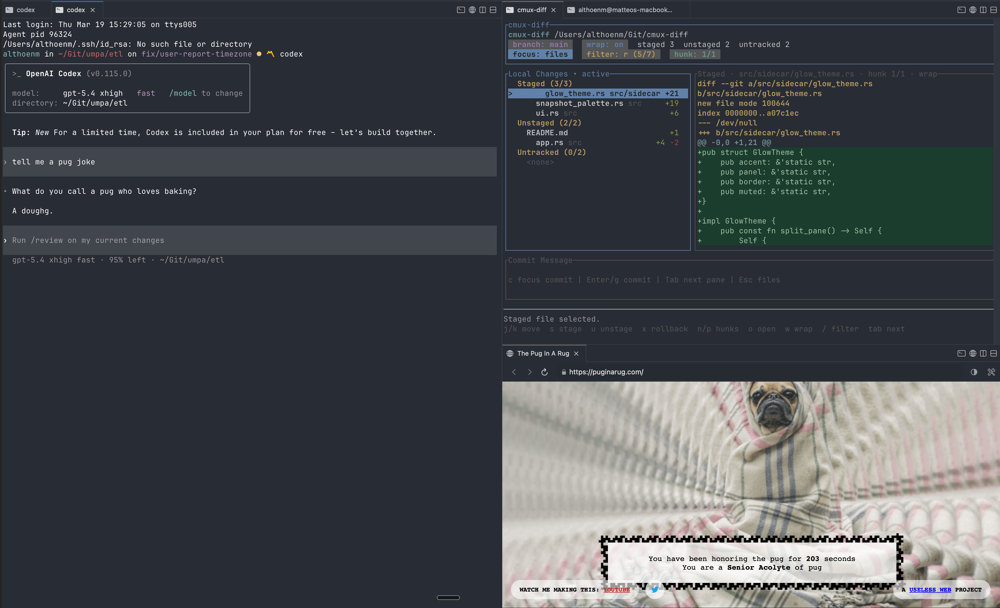

# cmux-diff

`cmux-diff` is a terminal UI for reviewing local Git changes in a split-pane workflow.

It is built for the "what changed in my working tree?" loop, not for broad repository management. The default view stays focused on your current local state instead of showing every file changed across a branch or pull request.



Shown above running inside `cmux` as a sidecar pane next to another terminal workflow.

## Why Use It

- stays focused on `Staged`, `Unstaged`, and `Untracked` files only
- works well in a side pane next to your editor or terminal session
- shows a unified diff with inline green/red highlights
- shows a tree-style file list with per-file `+/-` counts
- lets you stage, unstage, commit, filter, and jump between hunks without leaving the terminal

## Install

### Prerequisites

- `git`
- Rust stable with Cargo on `PATH`

### Install with Cargo

```bash
cargo install --locked --git https://github.com/althoenm/cmux-diff
```

Prebuilt binaries are not published yet.

### Run from Source

```bash
git clone https://github.com/althoenm/cmux-diff
cd cmux-diff
cargo run --quiet
```

## Quick Start

Run in the current repository:

```bash
cmux-diff
```

Run against a different repository:

```bash
cmux-diff /path/to/repo
```

If the provided path is inside a Git repository, `cmux-diff` resolves the repository root automatically.

## What the UI Shows

- a header with the repo path, current branch, wrap state, active focus, filter state, and hunk position
- a left pane grouped into `Staged`, `Unstaged`, and `Untracked`
- tree-style file rows with basename-first display and right-aligned green/red `+/-` stats
- a diff pane with inline highlighting, optional wrapping, and independent scrolling
- a commit input pane
- a footer with context-sensitive key hints

## Keybindings

### General

- `q`: quit
- `Tab`: cycle focus through files, diff, commit input, and filter
- `r`: refresh the working tree

### Files Pane

- `j` / `k` or arrow keys: move file selection
- `s`: stage the selected `Unstaged` or `Untracked` file
- `u`: unstage the selected `Staged` file
- `x`: destructive action for the selected file
- `g`: commit staged changes from the file list
- `c`: focus the commit input
- `/`: focus the live file filter

### Diff Pane

- `j` / `k` or arrow keys: scroll the diff independently
- `n` / `p`: jump to next or previous hunk
- `w`: toggle wrapped vs unwrapped diff lines
- `o`: open the selected file in your editor at the current hunk
- `Esc`: return to the file list

### Commit Input

- type to edit the commit message
- `Enter`: commit staged changes
- `Esc`: return to the file list

### Filter Input

- type to filter changed files live
- `Backspace`: edit the filter
- `Ctrl-U`: clear the filter
- `Enter` or `Esc`: return to the file list

## Destructive Actions

`x` is intentionally section-aware:

- on a `Staged` file, it rolls the file back to `HEAD`
- on an `Unstaged` file, it deletes the file from the working tree
- on an `Untracked` file, it deletes the file from disk

This makes the current section matter. Read the footer hint before using it.

## Editor Integration

`o` opens the selected file at the current hunk line when possible.

Supported editor commands include:

- `code`
- `codium`
- `cursor`
- `windsurf`
- `zed`
- `subl`
- `mate`

`cmux-diff` checks `CMUX_DIFF_EDITOR`, then `VISUAL`, then `EDITOR`. On macOS it falls back to `open` if no supported editor is configured.

## What It Does Not Do

`cmux-diff` is intentionally narrow in scope today. It does not currently include:

- branch-wide review mode
- pull request or GitHub integration
- hunk-level staging
- stash workflows
- side-by-side diffs
- commit graph browsing
- remote management

## How It Works

`cmux-diff` shells out to the system `git` binary for repository operations. The current implementation uses commands such as:

- `git status --porcelain=v2 --branch`
- `git diff --numstat -- <path>`
- `git diff -- <path>`
- `git diff --cached -- <path>`
- `git diff --cached --root -- <path>`
- `git diff --no-index -- /dev/null <path>`
- `git add -- <path>`
- `git restore --staged -- <path>`
- `git restore --source=HEAD --staged --worktree -- <path>`
- `git commit -m <message>`

The application does not require GitHub credentials and does not call remote APIs.

## Development

### Project Layout

- `src/app.rs`: application state, selection, filtering, commit flow, and hunk navigation
- `src/diff.rs`: diff parsing and scroll math
- `src/editor.rs`: open-in-editor integration
- `src/git.rs`: subprocess-backed Git adapter and status parsing
- `src/layout.rs`: pane geometry
- `src/model.rs`: shared domain and UI types
- `src/ui.rs`: ratatui rendering
- `tests/workflow.rs`: temp-repo integration tests

### Commands

```bash
cargo test
cargo fmt
cargo check
```

## Security

The current design is intentionally conservative:

- the application operates on local repositories only
- Git commands are executed with `std::process::Command`, not shell interpolation
- file paths are passed as command arguments instead of being embedded in shell strings
- no tokens, API keys, or service credentials are required for the current feature set

The main trust boundary is the local `git` executable and the target repository contents. Destructive file actions are already present, so any future work around confirmations, hunk editing, or remote-provider integration should be treated as higher-risk areas.

If you discover a security issue, avoid posting exploit details in a public issue.

## Roadmap

Likely next steps:

1. add branch review as a separate mode without changing the default local-changes workflow
2. add confirmation or safer affordances around destructive file actions
3. expand coverage for more complex repository states such as renames and binary files
4. improve release/install ergonomics beyond `cargo install`

## License

This project is licensed under Apache License 2.0. See `LICENSE` for the full text.
